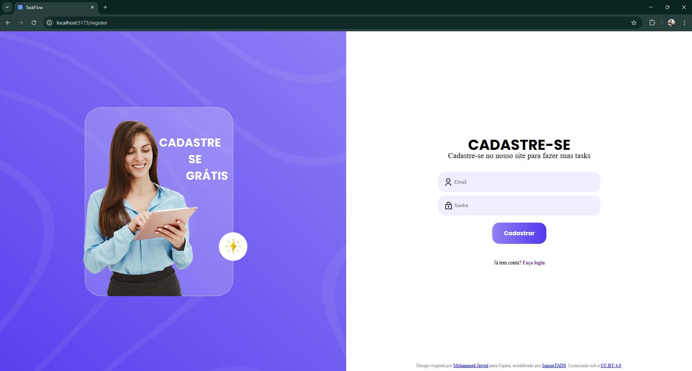
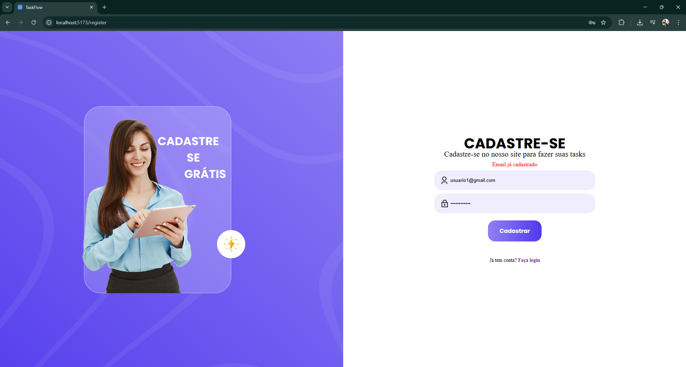
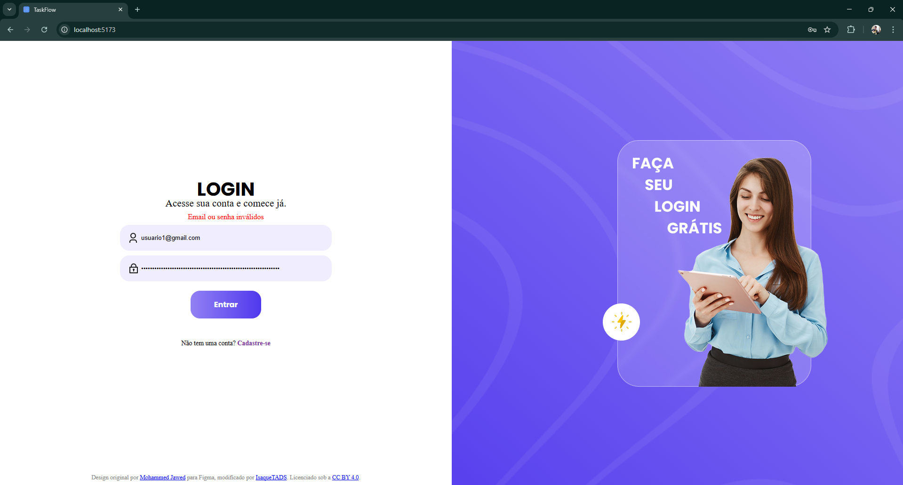
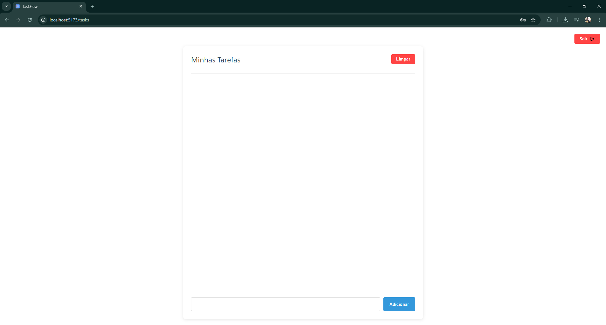
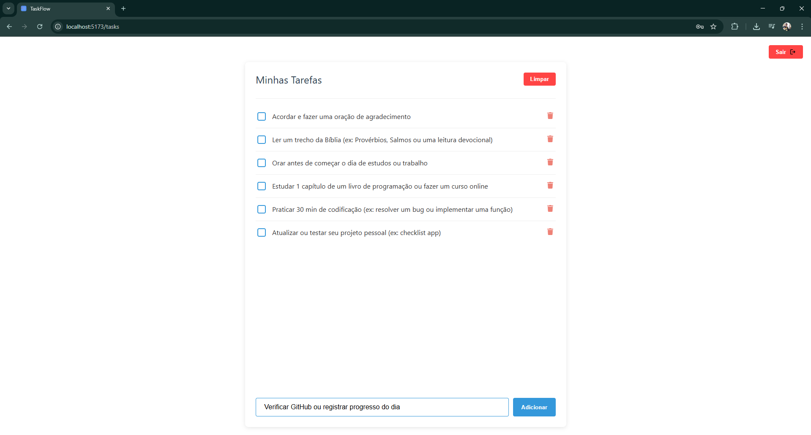
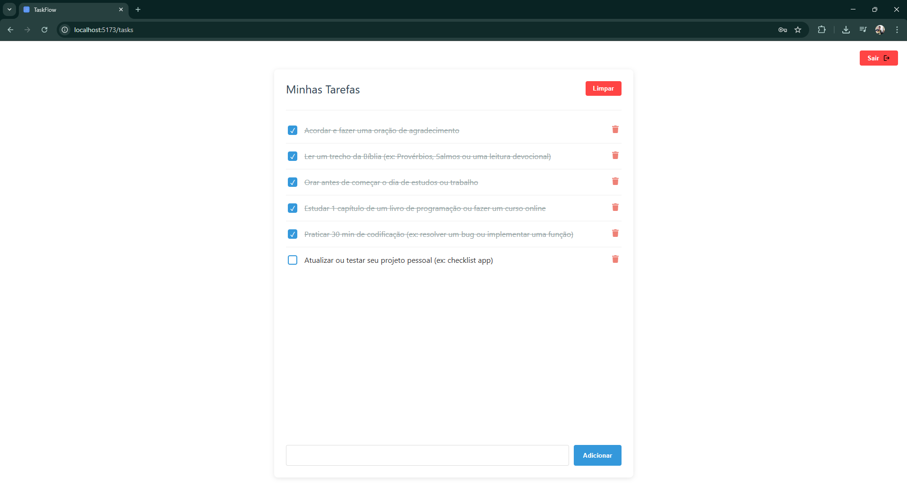
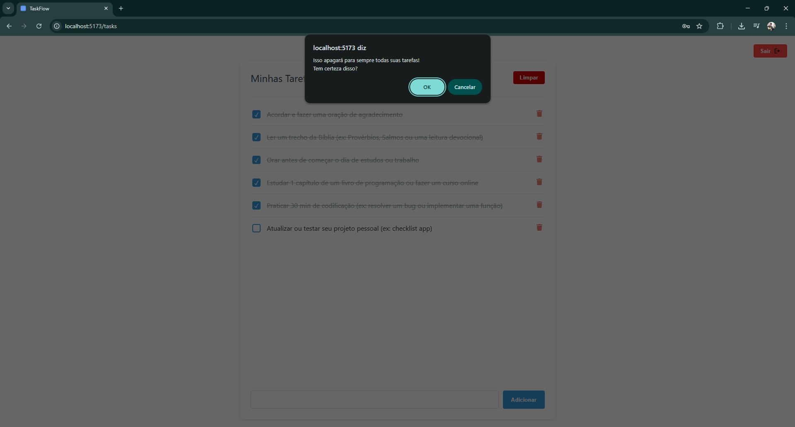

## 🚀 TaskFlow - Productivity Management System

## 📋 Table of Contents

- [🌟 Project Overview](#-project-overview)
- [✨ Key Features](#-key-features)
- [🛠 Technology Stack](#-technology-stack)
- [⚙️ Installation Guide](#️-installation-guide)
- [🖼 Screenshots](#-screenshots)
- [🤝 Contributing](#-contributing)
- [📜 License](#-license)

---

## 🌟 Visão Geral do Projeto

**TaskFlow** é um sistema de gerenciamento de tarefas que está atualmente em sua versão inicial. Existem atualizações planejadas para melhorar e expandir as funcionalidades do projeto no futuro.

### Principais Características:

- **Autenticação segura:** Implementada com JWT para garantir uma camada extra de segurança.
- **Reutilização de código:** Utiliza componentes React, facilitando a manutenção e escalabilidade do projeto.
- **Gerenciamento de tarefas:** Permite adicionar, excluir tarefas específicas ou deletar todas as tarefas de uma vez.

### Possíveis Melhorias Futuras:

- **Página Dashboard:** Adicionar uma visão geral das tarefas e métricas do usuário.
- **Seção de Tarefas:** Organizar tarefas em categorias, como "Hoje", "Todas", "Concluídas" e por datas específicas.
- **Padronização de código:** Implementar o uso do ESLint para garantir consistência e qualidade no código.


## ✨ Key Features

| 🔧 **Funcionalidade**          | 📝 **Descrição**                            |
| ------------------------------ | ------------------------------------------- |
| 🔍 **Organização Inteligente** | Uso arquitetura MVC                         |
| 🔐 **Segurança de Dados**      | Senhas criptografadas e rotas protegidas    |

---

## 🛠 Technology Stack

### 🎨 Frontend

<p align="left">
  
  
  
</p>

### 🧠 Backend

<p align="left">
  
  
  
  
</p>

---

# ⚙️ Installation Guide

## ✅ Pré-requisitos

- Node.js v18+
- PostgreSQL v15+
- Git instalado

---

## 🔌 Backend Setup

```bash
git clone https://github.com/IsaqueTADS/TaskFlow.git
cd taskflow/backend
npm install
cp .env.example .env
npx prisma migrate dev
npm run dev
```

## 🎨 Frontend Setup

```bash
cd ../frontend
npm install
npm run dev
```

## 🖼 Screenshots

  
**Login**

---

  
**Cadastre-se**

---

  
**Cadastre-se + Erro: e-mail repetido**

---

  
**Login + Erro: e-mail ou senha errados**

---

  
**Página de tasks quando o usuário loga pela primeira vez ou quando apaga todas as tasks**

---

  
**Criando novas tasks**

---

  
**Marcando como concluídas as tasks**

---

  
**Aviso ao clicar em "Limpar todas"**

---

## 🤝 Contributing

1. Fork este repositório
2. Crie uma branch: `git checkout -b feature/NovaFeature`
3. Commit suas alterações: `git commit -m 'Add NovaFeature'`
4. Push: `git push origin feature/NovaFeature`
5. Abra um Pull Request para branch dev

---

### 📜 License

Distribuído sob a Licença MIT. Veja o arquivo `LICENSE` para mais informações.

---

### 📄 Copy

Desenvolvido por **Isaque Rodrigues** (_IsaqueTADS_)  
Design das páginas de **login e cadastro** baseado no Figma criado por [**Mohammed Jawed**](https://www.figma.com/community/file/1256871498988476466/login-page-ui-design)

---

Desenvolvido com ❤️ por IsaqueTADS (Isaque Rordigues)
